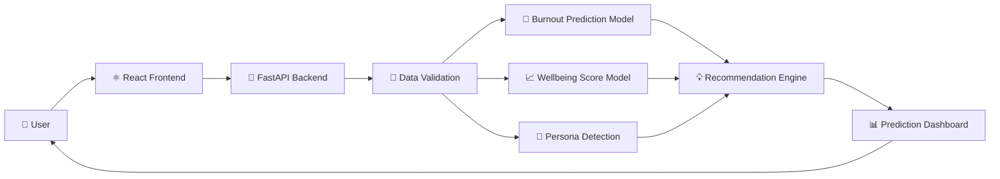
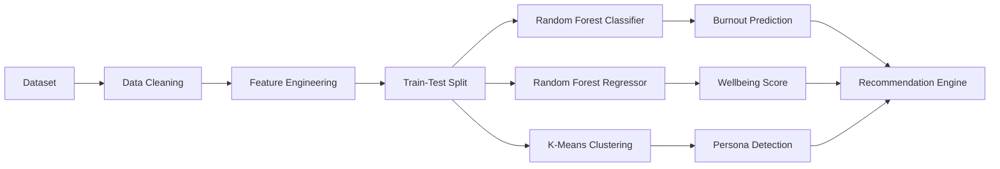

# 🌿 ThriveSync

AI-Powered Digital Wellness & Burnout Prediction Platform for Gen Z

ThriveSync is an AI-powered digital wellness platform that predicts burnout risk, estimates wellbeing scores, identifies behavioral personas, and provides personalized recommendations using machine learning.


## 📚 Table of Contents

- Overview
- Features
- Tech Stack
- Project Architecture
- Machine Learning Pipeline
- Dataset
- Model Performance
- Project Structure
- Installation
- API Endpoints
- Future Improvements

## 📖 Overview

Digital wellness has become an important concern for Gen Z due to increasing screen time, academic pressure, and social media usage. While many wellness applications track habits, they rarely provide predictive insights into burnout risk.

ThriveSync addresses this challenge by leveraging machine learning to analyze user lifestyle and wellness patterns. The platform predicts burnout risk, estimates a wellbeing score, identifies behavioral personas, and generates personalized recommendations that help users improve their digital wellbeing.

## ✨ Features

### 🤖 AI-Powered Burnout Prediction
- Predicts whether a user has **Low**, **Medium**, or **High** burnout risk using a trained Random Forest Classifier.

### 📊 Wellbeing Score Estimation
- Generates a personalized wellbeing score based on lifestyle, productivity, sleep quality, and mental wellness indicators.

### 👤 Persona Detection
- Classifies users into behavioral personas using K-Means clustering to better understand digital habits and wellness patterns.

### 💡 Personalized Recommendations
- Provides actionable recommendations based on the predicted burnout risk, wellbeing score, and detected persona.

### 🔍 Explainable AI
- Uses SHAP (SHapley Additive exPlanations) to highlight the most influential features behind each prediction, improving transparency and interpretability.

### 🌐 REST API
- Built with FastAPI to expose prediction services through clean and efficient API endpoints.

### 💻 Interactive Frontend
- User-friendly interface built with React and Vite for completing assessments and viewing prediction results.

## 🛠️ Tech Stack

| Category | Technology |
|----------|------------|
| Frontend | React, Vite, Tailwind CSS |
| Backend | FastAPI, Uvicorn |
| Machine Learning | Scikit-learn, SHAP |
| Database | PostgreSQL (Neon) |
| Language | Python, JavaScript |
| Version Control | Git, GitHub |

## 📸 Application Screenshots

### 🏠 Home Page

| Home Screen | Features |
|-------------|----------|
|  |  |

---

### 📝 Assessment

#### Page 1

| Question Set 1 | Question Set 2 | Question Set 3 |
|---------------|---------------|---------------|
|  |  |  |

#### Page 2

| Question Set 4 | Question Set 5 |
|---------------|---------------|
|  |  |

#### Page 3

| Question Set 6 | Question Set 7 |
|---------------|---------------|
|  |  |

#### Page 4

| Question Set 8 | Question Set 9 |
|---------------|---------------|
|  |  |

---

### 📊 Prediction Report

| Burnout Analysis | Wellbeing Score | Recommendations |
|-----------------|----------------|-----------------|
|  |  |  |

---

### 📜 Assessment History

| History | Previous Assessment |
|---------|---------------------|
|  |  |

<center>


</center>

## 🏗️ Project Architecture
ThriveSync follows a modular architecture that separates the frontend, backend, machine learning models, and data processing pipeline. User inputs are collected through the React frontend, processed by the FastAPI backend, analyzed using trained machine learning models, and returned as personalized predictions and recommendations.



## 🤖 Machine Learning Pipeline

The machine learning workflow consists of data preprocessing, feature engineering, model training, evaluation, and deployment. Separate models are used for burnout prediction, wellbeing score estimation, and persona detection.



## 📈 Model Performance

| Model | Algorithm | Performance |
|---------|-----------|------------|
| Burnout Prediction | Random Forest Classifier | **96% Accuracy** |
| Wellbeing Score Prediction | Random Forest Regressor | **MAE = 0.1027** |
| Wellbeing Score Prediction | Random Forest Regressor | **R² = 0.9857** |
| Persona Detection | K-Means Clustering | 4 Behavioral Personas |

## 🔍 Explainable AI

To improve model transparency, SHAP (SHapley Additive exPlanations) is integrated into the prediction pipeline. SHAP identifies the most influential features contributing to each burnout prediction, enabling users to understand **why** a prediction was made instead of receiving only the final result.

## 📂 Project Structure

```text
ThriveSync/
│
├── backend/
│   ├── app/
│   │   ├── api/
│   │   ├── config/
│   │   ├── models/
│   │   ├── schemas/
│   │   ├── services/
│   │   ├── main.py
│   │
│   └── requirements.txt
│
├── frontend/
│   ├── src/
│   ├── public/
│   └── package.json
│
├── models/
│   ├── burnout_model.pkl
│   ├── wellbeing_model.pkl
│   ├── persona_model.pkl
│   ├── persona_scaler.pkl
│   └── persona_names.pkl
│
├── notebooks/
│
├── data/
│
├── assets/
│
└── README.md
```

## ⚙️ Installation

```bash
git clone https://github.com/Vanya-igdtu/ThriveSync.git

cd ThriveSync
```
```bash
cd backend

python -m venv venv

# Windows
venv\Scripts\activate

# Linux / macOS
source venv/bin/activate

pip install -r requirements.txt
```

```bash
cd frontend

npm install
```

## 🚀 Running the Application
```bash
cd backend

uvicorn app.main:app --reload
```
```bash
cd frontend

npm run dev
```

The backend will start on:

http://127.0.0.1:8000

The frontend will start on:

http://localhost:5173

## 💻 Technologies Used

- Python
- FastAPI
- React
- Vite
- Tailwind CSS
- Scikit-learn
- SHAP
- PostgreSQL
- Git
- GitHub

## 🚀 Future Enhancements

- 🔐 User Authentication
- 📱 Mobile Application
- ⌚ Wearable Device Integration
- 🤖 AI Chat Assistant
- 📊 Advanced Analytics Dashboard
- 🔔 Real-Time Wellness Alerts
- 🌍 Multi-language Support
- ☁️ Cloud Model Deployment

## 👩‍💻 Author

**Vanya Khurana**

- GitHub: https://github.com/Vanya-igdtu
